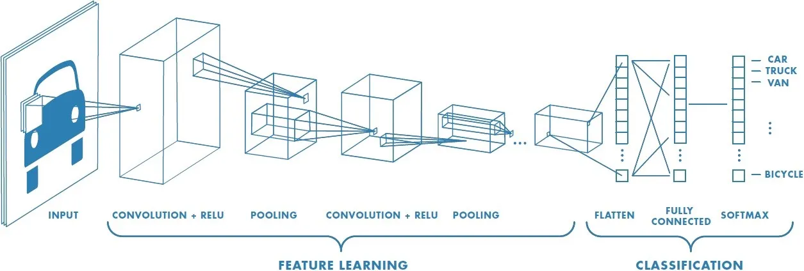
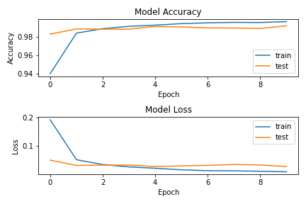
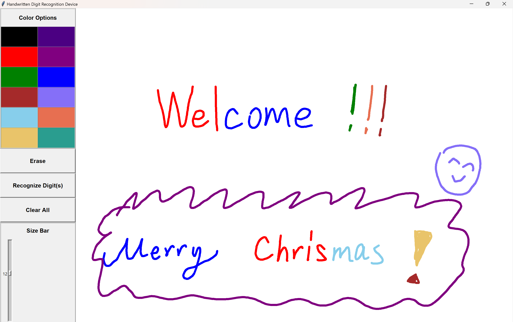
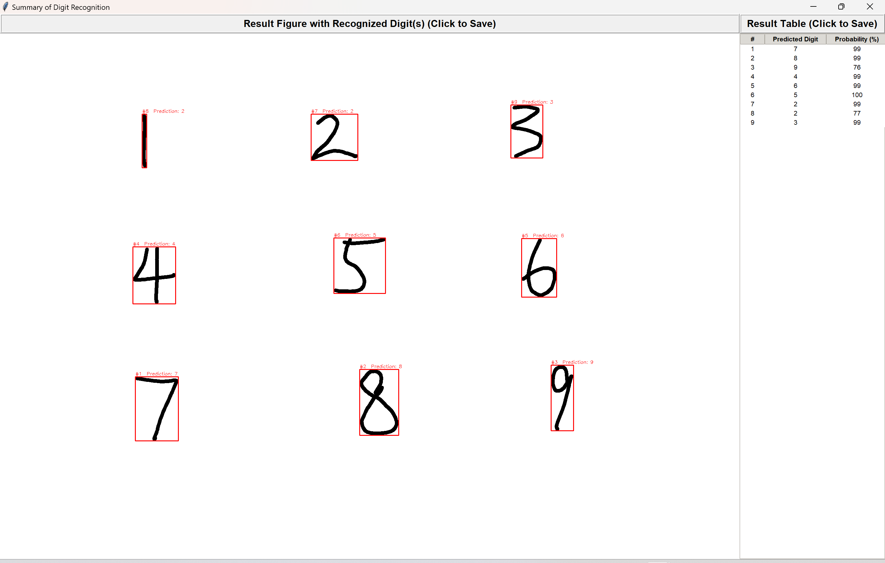

# Digit Recognition System

## Description

This simple digit recognition system is an APP for detecting the hardwritten digits in the screen. It uses a convolution neural network (CNN). It allows users to write in various colors besides black. Besides, it is a convenient and easily accessible app, with a good-looking GUI built using tkinter with thorough tools, by which we can save the valuable result for subsequent analysis of different AI model. However, the RNN model currently used does not have very high accuracy for hardwritten digits recognition (esp, the number '1').

* The topics of this project are object-oriented programming, AI/ML and GUI.

## Requirement

* PC monitor with scale of 200% and display resolution of 2880x1920
* Python version: 3.9+
* Python libraries: `tkinter`, `cv2`, `numpy`, `PIL`, `tensorflow`, `os`, `screeninfo`, `sys`, `matplotlib` and `keras`

## Usage

#### Training Model for Digit Recognition System

First, you need to train the CNN for the app. For this, please run `CNN_dian.py` directly and then a model is stored in the file `CNN_digit.h5`. However, you could also skip this step and using your own model for recognition, but the model should be able to be used by `load_model` method in the `tensorflow.keras.models` module and used for the grayscale figure of type of `numpy.ndarray` with format of 1x28x28x1 (= \[# of samples\]x\[width\]x\[height\]x\[channels\]).

The CNN model built here for single digit recorgnition contains 2 convolutional layers, 1 maxpooling layer, 1 flatten layer and 2 regular dense layers. A general architecture of CNN could be found below.

If you run `CNN_dian.py`, a png file named `myCNNPerformance.png` will be generated to show the model accuracy and loss for both train and test set. An example figrue of CNN model performance is shown below. From this figrue, the accuracy of our CNN model for test set is higher than 98%.

Note: 
* CNN training takes around 10 min, please be patient.
* The size of the model file `CNN_digit.h5` is 27,947 KB.
* If you use your own model, please change the model name in `GUI_dian1.py`.
* Our model refers to the one from [jaideep singh](https://medium.com/analytics-vidhya/handwritten-digit-recognition-gui-app-46e3d7b37287).

#### Digit Recognition System (1st/Root Window)

After model gets ready, you can use our Digit Recognition System!

After running `GUI_dian1.py` directly, a wonderful GUI is shown and you can start your journey of exploring digit recognition using CNN! The figure of GUI is shown below. The tool bar is on the left hand side, where several tools could be used: setting the ink color, eraser for the ink, recognition for the ink, clearing all the ink and setting the ink thinkness. On the right hand side, there is a white paper/canvas for you to draw.

If you want to let app recognize the digit you draw, please click `Recognize Digit(s)` button. After clicking, the digit analysis would be conducted using loaded (CNN) model and a new window is generated for showing the analysis data of digit recognition.

Note:
* For a relative recognition, size around 10 for ink is recommanded.
* Please make sure when hitting 'Recognize Digit(s)' button, the canvas wedgit in the root Tk window is not hidden by any object/pattern in your PC monitor window. Maximizing the Tk root window is recommanded!
* For a single digit recorgnition, your ink must be continuous. Otherwise, multiple digit recognition would be conducted.

#### Digit Recognition System (2nd Window)

After clicking `Recognize Digit(s)` button, a window named `Summary of Digit Recognition` pops up, where a figrue showing anaylysis result with original ink is on the left, and a corresponding summary table is on the right. A example `Summary of Digit Recognition` window is shown below.

In the result figure, each recognized digit is wrapped by a red rectangle, on top of which index for the digit and recorgnition result digit could be found. To save this figure, please click the button on the top, after which a png file named `Result_Figure_{#}` is generated in the folder `Results` under the current directory. # represents the number of time of saving figure or table for different digit recognition process.

The result table shows the predicted digits and probability of prediction for each recognized digit with corresponding index. Similarly, to save this table, please click the button on the top, after which a txt file named `Result_Table_{#}` is generated in the folder `Results` under the current directory.

A example of saved figure and table is shown in the `example` folder.

Note:
* Please remember to save the analysis you want, this app would not save automatically for you.
* The accuracy of ths app is not 100%. Especially, the recognition of 1 has very low accuracy. A potential reason would be using `cv2` to separate each digit. For 1, the width of separation would be short, and so CNN may not recognize the pattern correctly.
* When use this app for the first time after opening the editor, it may malfunction because of window size. If you find this problem, please close all the windows and repeat the process again.

## Caveats

* Please make sure to set your PC monitor with scale of 200% and display resolution of 2880x1920. Other params of monitor may generate malfunction.
* Please make sure when hitting 'Recognize Digit(s)' button, the canvas wedgit in the root Tk window is not hidden by any object/pattern in your PC monitor window. Maximizing the Tk root window is recommanded!
* Please save the result figrue and table (with reconization data) mannually if you want them for later analysis. App would not save automatically for you.

## Future Work
* Enable the result handwritten digits retrain the loaded model to get a more rubust and accurate model.
* Build a model with recognition of any ASCII character.
* Improve the accuracy of recognition of digit '1'.

## Reference

#### General Guides for this Digit Recognition System
* [Handwritten Digit Recognition GUI App](https://medium.com/analytics-vidhya/handwritten-digit-recognition-gui-app-46e3d7b37287)

#### Convolution Neural Network
* [Convolutional Neural Networks, Explained](https://towardsdatascience.com/convolutional-neural-networks-explained-9cc5188c4939)
* [A Comprehensive Guide to Convolutional Neural Networks — the ELI5 way](https://towardsdatascience.com/a-comprehensive-guide-to-convolutional-neural-networks-the-eli5-way-3bd2b1164a53)
* [Tensorflow - for beginners](https://www.tensorflow.org/tutorials)

#### Tkinter
* [Python Tkinter Tutorial](https://www.geeksforgeeks.org/python-tkinter-tutorial/?ref=lbp)
* [Tkinter - the Python interface for Tk](https://python-course.eu/tkinter/)
* [Build your own desktop apps with Python & Tkinter](https://www.pythonguis.com/tkinter-tutorial/#tkinter-getting-started)

#### OpenCV
* [OpenCV Python Tutorial](https://www.geeksforgeeks.org/opencv-python-tutorial/?ref=lbp)

## Acknowledgements

* Many, many thanks to Anastasia Georgious from Johns Hopkins University for guidance of this project.
* Thanks to everyone who works on all the awesome Python machine learning and GUI libraries like tensorflow, cv2, tkinter, keras, etc, etc that makes this kind of stuff so easy and fun in Python.
